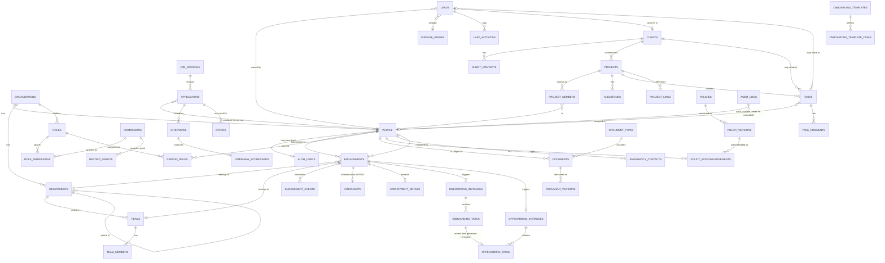

# PRAVSHI OS — Database Architecture & ERD

Companion to the [Master Blueprint](../superpowers/specs/2026-09-06-pravshi-os-master-blueprint.md).
Neon Postgres (branch per environment). **No code has been written; this is the design.**

---

## 1. Universal conventions

Applied to every business table, without exception:

```sql
id           uuid        primary key default gen_random_uuid()
org_id       uuid        not null references organizations(id)
created_at   timestamptz not null default now()
updated_at   timestamptz not null default now()   -- maintained by trigger
created_by   uuid        references people(id)
updated_by   uuid        references people(id)
deleted_at   timestamptz                          -- soft delete
```

Plus, where users need a human identifier: `code text not null` (unique per org, **immutable**).

Rules:

| Rule | Reason |
|---|---|
| `org_id` on every tenant table from day one | Retrofitting it across 45 tables plus every RLS policy is a rewrite (spec §33) |
| Soft delete via `deleted_at`; RLS filters it out by default | Business records are evidence (spec §31) |
| Configurable statuses live in reference tables, not enums | You will change pipeline stages; a migration per change is unacceptable |
| Genuinely fixed states use Postgres enums | `engagement_status`, `document_status` — changing these changes behaviour, so a migration is *correct* |
| Money is `numeric(14,2)` + explicit `currency char(3)` | Never floats |
| Emails are `citext` | Case-insensitive uniqueness without application discipline |
| Every FK is indexed; every RLS predicate column is indexed | RLS predicates run per row; an unindexed predicate column is a table scan on every query |
| No cascading deletes on business data | `on delete restrict` forces an explicit decision |

---

## 2. Human-readable codes

```sql
create table identity_counters (
  org_id   uuid not null references organizations(id),
  prefix   text not null,        -- 'EMP','INT','LEAD','PRJ','TSK','DOC','CTR'
  year     int  not null,
  last_no  bigint not null default 0,
  primary key (org_id, prefix, year)
);

-- next_code('EMP') -> 'EMP-2026-0001'
create function next_code(p_org uuid, p_prefix text, p_pad int default 4)
returns text language plpgsql as $$ ... $$;   -- SELECT ... FOR UPDATE inside the caller's txn
```

Codes are generated **inside the transaction that creates the row**, are never recomputed, and are
never used as a foreign key — relationships always use the UUID. The code is for humans; the UUID is
for the database.

---

## 3. Core identity tables

```sql
organizations(id, name, slug, domain, logo_url, timezone, locale, status, settings jsonb)

people(
  id, org_id, code,                          -- EMP-2026-0001 / INT-2026-0001 / CTR-2026-0001
  auth_user_id uuid unique,                  -- FK to the Better Auth user table; NULL pre-hire
  full_legal_name, preferred_name,
  work_email citext, personal_email citext, phone,
  date_of_birth date,                        -- sensitive: HR-only column policy
  photo_url, location, timezone,
  person_status,                             -- PROSPECT|ACTIVE|INACTIVE|ARCHIVED
  sessions_revoked_at timestamptz,           -- sessions issued before this are dead (§25)
  ...audit columns
)

engagements(
  id, org_id, person_id,
  engagement_type,        -- EMPLOYEE|INTERN|TRAINEE|CONTRACTOR|CONSULTANT|PART_TIME|TEMPORARY
  status engagement_status,-- PRE_ONBOARDING|ONBOARDING|ACTIVE|NOTICE_PERIOD|SUSPENDED|OFFBOARDING|ARCHIVED
  department_id, team_id, manager_person_id,
  job_title, work_location, employment_mode,   -- ONSITE|REMOTE|HYBRID
  start_date, expected_end_date, actual_end_date,
  exit_reason, exit_type,                      -- RESIGNED|COMPLETED|TERMINATED|CONVERTED
  is_primary boolean not null default true,
  ...audit columns
)

engagement_events(id, engagement_id, from_status, to_status, effective_date,
                  reason, actor_person_id, occurred_at)

internships(engagement_id pk, mentor_person_id, program_name, stipend_amount, currency,
            mid_review_date, final_review_date, outcome, certificate_document_id)
```

**Why `person_status` and `engagement.status` both exist.** The person is a long-lived record
(`ACTIVE` while we have any live relationship). The engagement is a period with its own state
machine. A person can be `ACTIVE` with an engagement in `OFFBOARDING`. Conflating them makes re-hire
and multi-engagement history impossible to represent (Blueprint §6).

**The uniqueness rule that prevents a whole class of bugs:**

```sql
create unique index one_primary_active_engagement
  on engagements (person_id)
  where status in ('PRE_ONBOARDING','ONBOARDING','ACTIVE','NOTICE_PERIOD')
    and is_primary and deleted_at is null;
```

---

## 4. Authorization tables

```sql
roles(id, org_id, key, name, description, is_system bool, is_protected bool, status)
      -- is_system: cannot be deleted.  is_protected: only GLOBAL roles.manage may grant it.

permissions(id, key, resource, action, module, description, is_sensitive bool)
      -- key = 'leads.view'. Seeded by migration; modules add rows, never code.

role_permissions(role_id, permission_id, scope access_scope, primary key(role_id, permission_id))
      -- access_scope enum: GLOBAL | DEPARTMENT | TEAM | PROJECT | SELF

person_roles(person_id, role_id, granted_by, granted_at, expires_at,
             primary key(person_id, role_id))

record_grants(id, org_id, entity_type, entity_id, person_id, permission_id,
              granted_by, reason, granted_at, expires_at, revoked_at)
```

### 4.1 The `authz` helper functions — the whole security model in one schema

Every RLS policy is written in terms of these. Adding a table means writing a policy, not new logic.

```sql
create schema authz;

authz.person_id()      -- current_setting('app.person_id')::uuid   ← set by withAuthorizedDb()
authz.org_id()         -- current_setting('app.org_id')::uuid
authz.is_active()      -- engagement status is ACTIVE, read FROM THE TABLE, on every query
authz.aal()            -- current_setting('app.aal')  →  'aal1' | 'aal2'
authz.scope_for(p text)-- broadest access_scope for permission p, or NULL if not granted
authz.has(p text)      -- scope_for(p) is not null
authz.my_departments() -- uuid[]  (primary + secondary)
authz.reports_to_me(person uuid)   -- recursive manager chain
authz.is_project_member(project uuid)
authz.has_record_grant(entity_type text, entity_id uuid, p text)
```

All are `stable security definer` with `search_path = ''`, and are the **only** functions granted to
`app_user`.

`current_setting('app.person_id', true)` returns NULL when the setting is absent — which is exactly
what happens if a query runs outside `withAuthorizedDb()`. Every helper treats NULL as "no identity",
so an unscoped query returns **zero rows** rather than every row. Fail-closed by construction.

### 4.2 The standard policy shape

Every ownable table's SELECT policy follows this template. Note the `(select …)` wrapper — it makes
Postgres evaluate the helper **once per query** as an InitPlan rather than once per row, which is the
difference between fast and unusable:

```sql
create policy leads_select on leads for select to app_user
using (
  org_id = (select authz.org_id())
  and deleted_at is null
  and (select authz.is_active())
  and (
    case (select authz.scope_for('leads.view'))
      when 'GLOBAL'     then true
      when 'DEPARTMENT' then department_id = any ((select authz.my_departments())::uuid[])
      when 'TEAM'       then owner_person_id = (select authz.person_id())
                            or (select authz.reports_to_me(owner_person_id))
      when 'PROJECT'    then (select authz.is_project_member(project_id))
      when 'SELF'       then owner_person_id = (select authz.person_id())
      else false
    end
    or (select authz.has_record_grant('lead', id, 'leads.view'))
  )
);
```

Separate policies for `insert`, `update`, `delete`, each using the matching permission key.
**`deleted_at is null` lives in the policy**, so a forgotten `WHERE` clause in application code
cannot resurrect deleted rows.

Sensitive tables add `and (select authz.aal()) = 'aal2'`.

### 4.3 Database roles, and why they matter more than any policy

RLS is **not enforced against a table's owner or any role with `BYPASSRLS`**. A project that
connects as the owner has policies that look correct, review as correct, and do nothing. It is the
most dangerous configuration available here precisely because nothing appears wrong.

```sql
create role app_owner login;   -- migrations only, from CI. Owns every object.
create role app_user  login;   -- the application at runtime. NOT the owner. No BYPASSRLS.
create role app_admin login;   -- three audited paths only: bootstrap, provisioning, audit writer

grant usage on schema public, authz to app_user;
grant select, insert, update on all tables in schema public to app_user;
revoke update, delete on audit_logs from app_user, app_admin, app_owner;
alter default privileges for role app_owner in schema public
  grant select, insert, update on tables to app_user;
```

Then, in every migration that creates a table:

```sql
alter table <t> enable row level security;
alter table <t> force  row level security;   -- applies policies even to the owner
```

`FORCE ROW LEVEL SECURITY` is the belt to that braces: even if something one day connects as
`app_owner` by mistake, policies still apply.

**CI asserts three things on every run**, and the build fails otherwise:

1. Every table in `public` has `relrowsecurity` and `relforcerowsecurity` set.
2. Every table has at least one policy.
3. The role in the runtime `DATABASE_URL` has `rolbypassrls = false` and owns nothing.

### 4.4 The connection contract

Neon's pooled endpoint runs PgBouncer in transaction mode. `SET LOCAL` is scoped to a transaction,
which makes it safe there — and makes a plain `SET` (session-scoped) actively dangerous, because a
pooled connection is reused by the next request and would carry one person's identity into another
person's query. **Never use `SET`. Always `SET LOCAL`, always inside an explicit transaction.**

```ts
// The only path to the database. Everything else is a bug.
export async function withAuthorizedDb<T>(ctx: AuthContext, fn: (tx: Tx) => Promise<T>) {
  // 1. Establish the connection through the cold-start-aware path (§4.5).
  const client = await connectWithWake();
  try {
    const db = drizzle(client);
    // 2. Transaction  3. SET LOCAL identity  4. Callback  5. Commit / rollback
    return await db.transaction(async (tx) => {
      await tx.execute(sql`
        select set_config('app.person_id', ${ctx.personId}, true),   -- true = LOCAL
               set_config('app.org_id',    ${ctx.orgId},    true),
               set_config('app.aal',       ${ctx.aal},      true)
      `);
      return fn(tx);
    });
  } finally {
    client.release();   // always — a leaked connection exhausts the pool silently
  }
}
```

The connection is acquired through `connectWithWake()` rather than from the pool directly, so the
first request after an autosuspend wakes the compute instead of failing. **The retry lives on the
connect and nowhere else**: business work is never replayed, because a connection lost mid-`COMMIT`
is ambiguous and a blind retry can double-write.

Two consequences to design around:

- The **HTTP one-shot driver cannot be used for authorized reads** — it has no transaction, so no
  context, so no rows. Use the WebSocket `Pool`. The HTTP driver is fine only for genuinely
  context-free work such as health checks.
- Read-only requests still pay for a transaction. At your scale this is irrelevant; it is worth
  stating so nobody "optimises" it away later and silently disables authorization.

### 4.5 Living with scale-to-zero

Autosuspend is a **locked V1 decision** (Blueprint §4.1): compute suspends when PRAVSHI OS is idle
and wakes on the next request. Nothing in this system may be built to keep it awake.

The pool must therefore treat a dropped connection as normal rather than exceptional:

```ts
// Idle connections are expected to die when compute suspends.
const pool = new Pool({
  connectionString: process.env.DATABASE_URL,  // the -pooler endpoint
  idleTimeoutMillis: 10_000,   // release early; a suspended compute kills them anyway
  connectionTimeoutMillis: 10_000,  // generous: this is where a cold start is paid
  max: 5,                      // per serverless instance, not per app
});
```

**Retry rule, and the boundary matters more than the retry.** Retry with backoff **only** when the
failure happened while *establishing* a connection — the cold-start case. Never retry a transaction
that may already have applied: a lost connection mid-transaction means Postgres rolled it back, but
a lost connection mid-*commit* is genuinely ambiguous, and a blind retry can double-write.

```ts
// Retry the connect. Never blind-retry the work.
const RETRYABLE = new Set(['ECONNRESET','ETIMEDOUT','ENOTFOUND','57P01','08006','08001']);
async function connectWithWake(attempt = 0): Promise<Client> {
  try { return await pool.connect(); }
  catch (e) {
    if (attempt >= 3 || !RETRYABLE.has(codeOf(e))) throw e;
    await sleep(250 * 2 ** attempt);          // 250ms, 500ms, 1s
    return connectWithWake(attempt + 1);
  }
}
```

Writes that must survive an ambiguous commit use the idempotency keys from Blueprint §24 — which is
why those exist independently of this decision.

**The trap nobody sets deliberately:** a health endpoint that runs a query, polled every 60 seconds
by an uptime monitor, is a keep-alive. It will hold compute open around the clock and nobody will
notice until the bill arrives. So `/health` returns process liveness with **no database access at
all**, and a separate `/health/db` exists for CI and humans — never for a monitor.

---

## 5. Module tables (summary)

**People/HR:** `departments` · `teams` · `team_members` · `person_departments` ·
`emergency_contacts` · `employment_details` (compensation — separate table, separate permission,
`FINANCE`/`HR_ADMIN` only)

**Hiring:** `job_openings` · `applications` · `interviews` · `interview_scorecards` · `offers`

**Sales:** `leads` · `clients` · `client_contacts` · `pipeline_stages` · `lead_activities`

**Delivery:** `projects` · `project_members` · `milestones` · `tasks` · `task_comments` ·
`project_links`

**Records:** `document_types` · `documents` · `document_versions` · `policies` ·
`policy_versions` · `policy_acknowledgements`

**Workflow:** `onboarding_templates` · `onboarding_template_tasks` · `onboarding_instances` ·
`onboarding_tasks` · `offboarding_instances` · `offboarding_tasks`

**Platform:** `audit_logs` · `notifications` · `settings` · `invitations` · `login_events` ·
`identity_counters` · `attachments`

Total: **~45 tables** for V1.

---

## 6. ERD



### Reading the ERD — the five relationships that carry the design

1. **`PEOPLE → ENGAGEMENTS`** (1:N). The re-hire and conversion story. Everything about access hangs
   off the *active* engagement, not the person.
2. **`ROLES → ROLE_PERMISSIONS → PERMISSIONS`** with `scope` on the join. The join row carries the
   scope, which is why one permission serves both Sales and Sales Manager.
3. **`PROJECTS → PROJECT_MEMBERS`**. The mechanism for `PROJECT`-scoped access — how a vibecoder gets
   exactly one project and nothing else.
4. **`ONBOARDING_TASKS → OFFBOARDING_TASKS`** where `is_access_task`. Access granted is access
   tracked, so it can be revoked.
5. **`AUDIT_LOGS`** references everything and is referenced by nothing. It must survive the deletion
   of what it describes, so actor identity is stored as both a nullable FK **and** a denormalised
   email snapshot.

---

## 7. Security boundaries in the schema

| Boundary | Tables | Enforcement |
|---|---|---|
| **Tenant** | everything with `org_id` | `org_id = authz.org_id()` in every policy |
| **Sensitive HR** | `employment_details`, `emergency_contacts`, `people.date_of_birth` | Separate permission `hr.sensitive.view`; column-level policy; `aal2` |
| **Financial** | `employment_details`, offer compensation, lead `expected_value` | `finance.*` permissions; HR does **not** inherit these (spec §25) |
| **Audit** | `audit_logs`, `login_events`, `policy_acknowledgements` | Append-only: `revoke update, delete`; trigger raises on attempt |
| **Configuration** | `roles`, `permissions`, `role_permissions`, `settings` | `GLOBAL` scope only; protected-role rule; every change audited |
| **Documents** | `documents`, `document_versions` | Metadata by RLS; bytes only via signed URL from a server route |

---

## 8. Index plan (V1)

```sql
-- tenancy + soft delete: on every table
create index on <table> (org_id) where deleted_at is null;

-- RLS predicate columns
create index on leads (owner_person_id) where deleted_at is null;
create index on leads (department_id)   where deleted_at is null;
create index on tasks (assignee_person_id, status);
create index on project_members (person_id);
create index on project_members (project_id);
create index on engagements (person_id, status);
create index on engagements (manager_person_id) where status = 'ACTIVE';
create index on person_roles (person_id);
create index on documents (subject_person_id) where deleted_at is null;
create index on record_grants (person_id, entity_type, entity_id) where revoked_at is null;

-- query patterns
create index on leads (status, follow_up_date) where deleted_at is null;
create index on tasks (due_date) where status <> 'DONE' and deleted_at is null;
create index on audit_logs (org_id, occurred_at desc);
create index on audit_logs (entity_type, entity_id, occurred_at desc);
create index on audit_logs (actor_person_id, occurred_at desc);

-- search (Phase 7)
create index on people   using gin (to_tsvector('simple', full_legal_name || ' ' || coalesce(preferred_name,'')));
create index on leads    using gin (to_tsvector('simple', name || ' ' || coalesce(company,'')));
```

`audit_logs` is **partitioned by month** from the first migration. Retrofitting partitioning onto a
large table is painful; doing it on an empty one is free.

---

## 9. Migration discipline

- One concern per migration file, named `NNNN_verb_noun.sql`.
- Every migration that creates a table **must, in the same file**: enable RLS, create policies, create
  indexes, and grant only what is needed. A table without RLS must never reach `develop`.
  A CI check asserts `rowsecurity = true` for every table in `public`.
- Migrations are forward-only. A mistake is fixed by a new migration.
- Destructive changes (drop column, drop table) require a two-step deploy: stop writing, then drop.
- `drizzle/**` is CODEOWNERS-protected (Blueprint §28).

---

## 10. Seed data (development only)

Marked with an obvious banner, `org.slug = 'pravshi-dev'`, and guarded so it refuses to run against
a production URL. **Never real employee data** (spec §60).

| Seed user | Role | Purpose |
|---|---|---|
| `owner@example.test` | SUPER_ADMIN | Admin surfaces |
| `hr@example.test` | HR_ADMIN | HR boundary tests |
| `salesmgr@example.test` | SALES_MANAGER | `DEPARTMENT` scope |
| `sales1@example.test` / `sales2@example.test` | SALES | `SELF` scope + isolation between peers |
| `dev@example.test` | DEVELOPER | `PROJECT` scope |
| `intern@example.test` | INTERN, VIBECODER | Minimum-access assertions |
| `suspended@example.test` | EMPLOYEE (SUSPENDED) | Revocation tests |
| `alumni@example.test` | (ARCHIVED) | Offboarded-access tests |

These eight accounts **are** the permission test suite's fixtures — the seed and the tests are
designed together, not separately.
